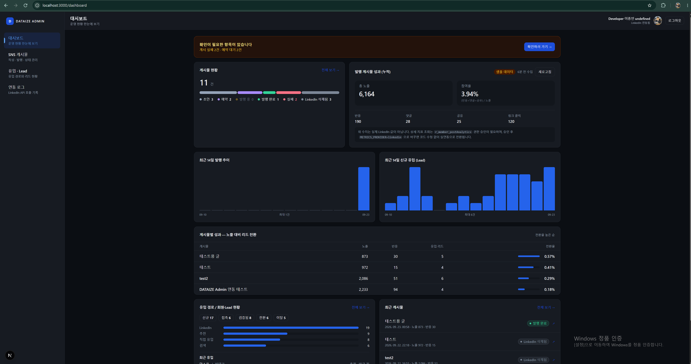
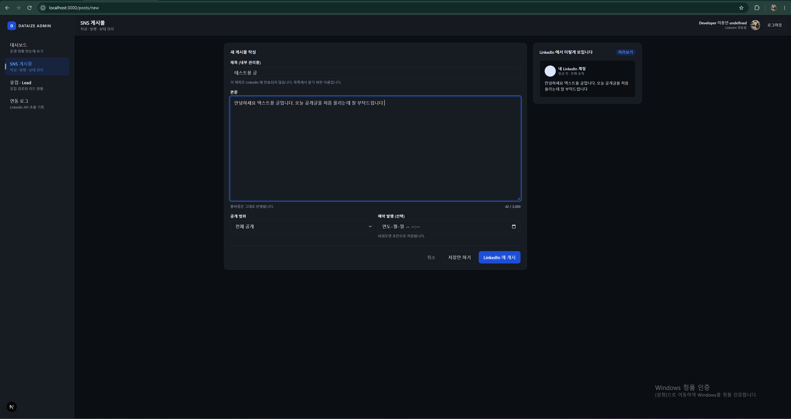
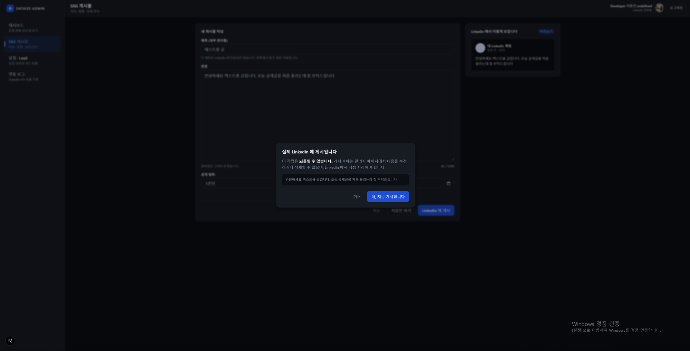
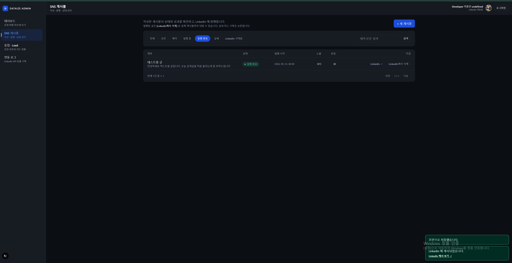
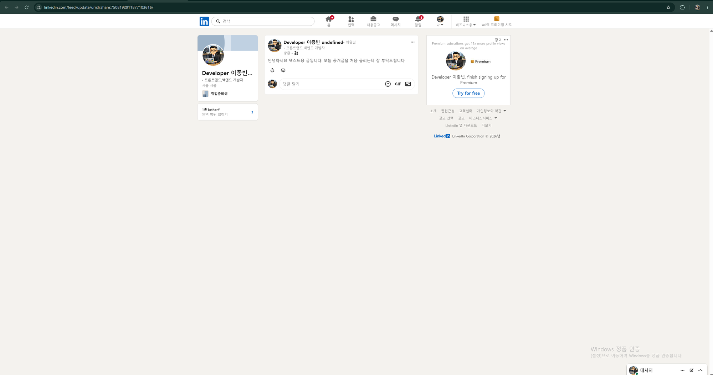
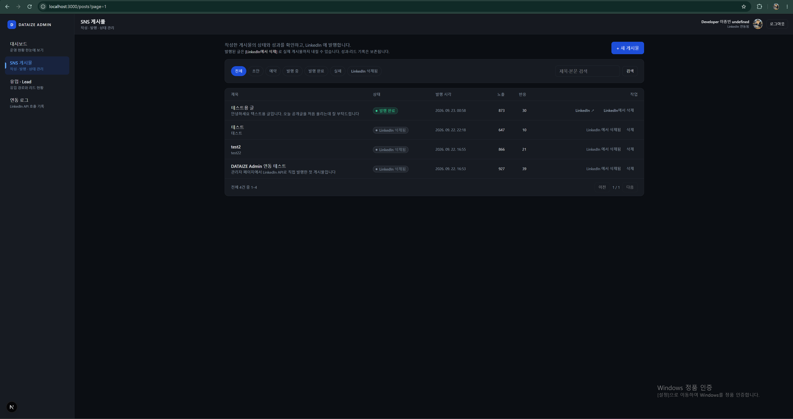
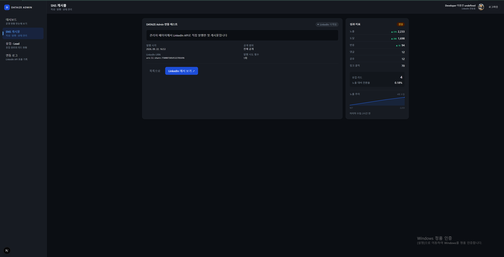
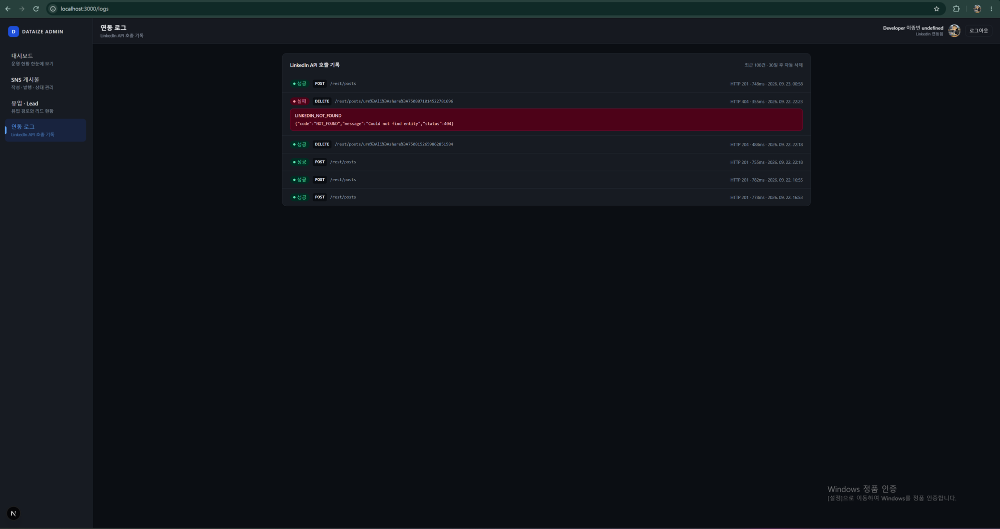
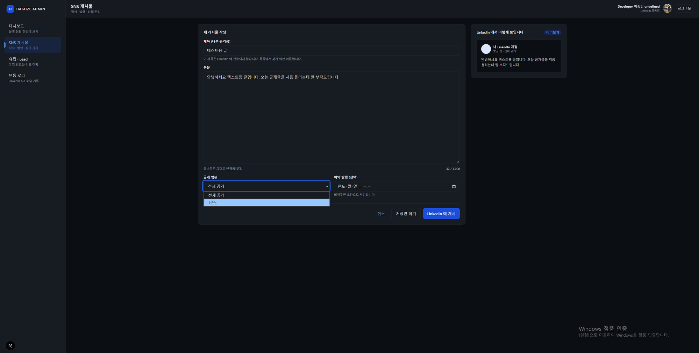
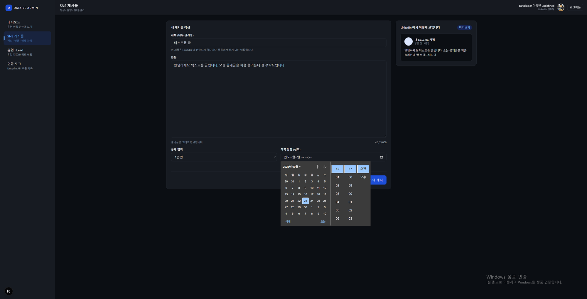

# DATAIZE Admin — LinkedIn SNS 운영 관리자

LinkedIn 계정으로 로그인해 글을 쓰고 실제 LinkedIn에 발행하는 관리자 페이지입니다.
발행 상태와 성과 지표, 유입 리드 현황을 한 화면에서 봅니다.

쓰는 사람이 마케팅·운영 담당자라는 점을 기준으로 잡았습니다. 개발자를 부르지 않고
혼자 원인을 찾고 해결할 수 있는가, 그게 설계할 때 제일 먼저 본 기준입니다.

---

## 1. 실행 방법

### 사전 준비

Node.js 20 이상, MongoDB(Atlas 무료 M0 또는 로컬), LinkedIn 개발자 앱 1개가 필요합니다.

LinkedIn 앱은 이렇게 만듭니다.

1. [회사 페이지](https://www.linkedin.com/company/setup/new/)를 먼저 만듭니다. 앱 생성에 필수입니다.
2. [개발자 앱 생성](https://www.linkedin.com/developers/apps/new) → 위 페이지를 연결하고 Verify.
3. Products 탭에서 두 개를 요청합니다. 둘 다 self-serve라 바로 승인됩니다.
   - `Sign In with LinkedIn using OpenID Connect` → `openid` `profile` `email`
   - `Share on LinkedIn` → `w_member_social`
4. Auth 탭의 Authorized redirect URLs에 `http://localhost:3000/api/auth/linkedin/callback` 을 넣습니다.
5. Client ID와 Client Secret을 복사합니다.

### 환경변수

> 평가용으로 빠르게 실행하시려면, 제출 메일에 동봉한 환경변수 내용을 프로젝트 루트에
> `.env.local` 로 저장하시면 위 과정 없이 바로 돌아갑니다. 해당 자격증명은 평가 전용이며
> 평가가 끝나면 폐기할 예정입니다.

직접 설정하실 경우입니다.

```bash
cp .env.example .env.local        # Windows: copy .env.example .env.local
```

실제 값은 `.env.local` 에만 넣습니다. `.env.example` 은 어떤 변수가 필요한지 알려주는 견본이라
값이 빈 채로 커밋되고, `.env.local` 은 `.gitignore` 가 막습니다.

`SESSION_SECRET` 과 `TOKEN_ENCRYPTION_KEY` 는 아래 명령으로 각각 따로 만들어 넣으세요.

```bash
node -e "console.log(require('crypto').randomBytes(32).toString('hex'))"
```

### 실행

```bash
npm install
npm run dev          # http://localhost:3000

npm run test         # 도메인 로직 검증 (DB·네트워크 불필요, 1초)
npm run typecheck
npm run build
```

유입/Lead 화면은 실제 랜딩 페이지가 있어야 데이터가 쌓입니다. 화면 확인용으로 예시 데이터를 넣을 수 있습니다.

```bash
npm run seed            # 리드 42건 + 게시물 7건 + 지표 수집 이력
npm run seed:clean      # 예시 데이터만 삭제
```

게시물 7건은 `DRAFT` 3, `SCHEDULED` 2, `FAILED` 2 입니다. `PUBLISHED` 는 만들지 않습니다.
가짜 URN을 넣으면 실제로 발행한 것처럼 보이기 때문입니다. 나머지 세 상태는 LinkedIn에
닿은 적이 없는 로컬 상태라 예시로 만들어도 사실과 어긋나지 않습니다.

예시 데이터에는 `_seed: true` 표식이 붙고, `seed:clean` 은 그 표식이 있는 문서만 지웁니다.
직접 작성하거나 발행한 데이터는 삭제되지 않습니다.

---

## 2. 기술 스택과 선택 이유

| 영역 | 기술 | 이유 |
|---|---|---|
| 프레임워크 | Next.js 16 (App Router) | 화면과 API를 한 프로젝트에서 운영. Client Secret과 액세스 토큰이 서버에만 있어야 하는데, 서버 컴포넌트와 라우트 핸들러가 그 경계를 자연스럽게 만들어 줍니다 |
| 언어 | TypeScript (strict) | 외부 API 응답·DB 문서·화면 모델의 형태를 타입으로 고정해 런타임 오류를 컴파일 시점으로 끌어올립니다 |
| UI | React 19 + Tailwind CSS v4 | 디자인 토큰을 `globals.css` 한 곳에 두어 "같은 의미는 항상 같은 색"을 코드로 강제 |
| DB | MongoDB 공식 드라이버 | Mongoose 대신 드라이버를 직접 썼습니다. 스키마 설계와 인덱스, 집계 파이프라인을 감추지 않으려고요 |
| 검증 | zod | 프론트 폼 검증과 백엔드 API 검증이 같은 스키마 하나를 공유합니다 |
| 세션 | jose(JWT) + httpOnly 쿠키 | 외부 세션 스토어 없이 동작하되 LinkedIn 토큰은 쿠키에 담지 않습니다 |
| 차트 | 직접 구현 | 막대 차트 하나에 라이브러리를 더하지 않았습니다 |

Redux/Zustand 같은 상태관리와 React Query는 넣지 않았습니다. 화면 간 공유 상태가 없고,
목록 필터는 URL 쿼리스트링을 단일 소스로 쓰기 때문입니다. 덕분에 `/posts?status=FAILED` 같은
화면 상태를 그대로 공유하거나 북마크할 수 있습니다.

---

## 3. 프로젝트 구조

### 프론트엔드와 백엔드의 경계

한 프로젝트 안에 있지만 실행 위치가 다릅니다. 폴더가 그 경계를 그대로 나타냅니다.

| 구분 | 위치 | 실행 위치 |
|---|---|---|
| 백엔드 — 엔드포인트 | `app/api/**` | 서버 |
| 백엔드 — 로직 | `server/**` | 서버 (클라이언트 번들에 포함되지 않음) |
| 프론트엔드 | `features/**/components`, `shared/ui/**` | 브라우저 |
| 화면 껍데기 | `app/(admin)/**/page.tsx` | 서버 컴포넌트 |
| 공유 | `entities/**`, `shared/lib/**`, `shared/api/**` | 양쪽 |

`server/**` 가 브라우저에 가지 않기 때문에 MongoDB 연결 문자열과 LinkedIn Secret을 그 안에서
다뤄도 안전합니다. 폴더를 이렇게 나눈 가장 큰 이유입니다.

API 응답 계약은 양쪽이 다 필요로 하지만, 응답을 만드는 코드는 서버 전용입니다. 그래서 둘을 나눴습니다.
`shared/api/contract.ts` 에는 런타임 의존성이 아예 없고, `NextResponse` 를 쓰는 코드는
`server/http/response.ts` 에 있습니다.

```
src/
├── app/
│   ├── (admin)/          dashboard · posts · leads · logs   (인증 가드)
│   └── api/              auth/linkedin · posts · metrics · analytics · logs
│
├── entities/             도메인 모델 — post(상태·전이 규칙·색 토큰) · lead · user
│
├── features/             프론트엔드
│   ├── posts/            api · model · components(+ list/ 4개)
│   ├── analytics/        model/dashboard.ts · components(+ sections/ 7개)
│   └── auth/             AdminShell
│
├── shared/
│   ├── api/contract.ts   ApiResult · 에러 코드 (런타임 의존성 없음)
│   ├── ui/               배럴(index.ts) + charts/
│   └── lib/ · config/    date · format · http · env
│
└── server/               백엔드 전용
    ├── db/mongo.ts       커넥션 + 인덱스 정의
    ├── http/response.ts  ok / fail / AppError / withErrorHandling
    └── repositories/ · services/ · linkedin/ · auth/ · crypto.ts
```

### 의존 방향

```
app  →  features  →  entities  →  shared
 └──→  server  →  repositories → db
```

`features/posts` 는 `features/leads` 를 직접 import하지 않습니다. 필요하면 `app` 레이어에서 조합합니다.
`shared` 는 어떤 도메인도 알지 못하고, `entities` 는 DB도 화면도 모릅니다. 그래서
`canTransition()` 같은 규칙을 DB 없이 테스트할 수 있습니다.

### 파일을 쪼갠 기준

화면 컴포넌트는 데이터를 다루는 파일과 보여주는 파일로 나눴습니다.

```
DashboardView.tsx   490줄  →  133줄 + 섹션 7개
PostListView.tsx    445줄  →  183줄 + 표현 4개
```

`DashboardView` 를 열면 화면이 어떤 순서로 무엇을 보여주는지가 한 눈에 들어옵니다. 각 섹션이
어떻게 생겼는지는 해당 파일만 보면 되고, 섹션을 추가하거나 빼도 다른 섹션에 영향이 없습니다.

`shared/ui` 는 배럴을 두어 화면 코드가 개별 경로를 알지 않게 했습니다.

```ts
import { Button, Card, Modal, BarChart } from '@/shared/ui';
```

### 타입이 구조를 강제합니다

상태나 에러 코드처럼 빠짐없이 다뤄야 하는 목록은 `Record<PostStatus, T>` 형태로 선언했습니다.
목록에 항목을 추가하면 처리하지 않은 지점이 전부 컴파일 에러로 드러납니다.

실제로 `REMOVED` 상태(5-3)를 추가했을 때 TypeScript가 두 곳을 짚어 주었습니다.

```
StatusBadge.tsx    Property 'REMOVED' is missing in type ... Record<PostStatus, BadgeTone>
postRepository.ts  Property 'REMOVED' is missing in type ... Record<PostStatus, number>
```

상태를 늘리면서 뱃지 색이나 집계 초기값을 빠뜨리는 사고가 구조적으로 불가능합니다.

---

## 4. 실제 연동한 LinkedIn API 범위

| 기능 | Endpoint | 권한 | 상태 |
|---|---|---|---|
| OAuth 인증 | `GET /oauth/v2/authorization` | — | 실연동 |
| 토큰 교환 | `POST /oauth/v2/accessToken` | — | 실연동 |
| 프로필 조회 | `GET /v2/userinfo` | `openid` `profile` `email` | 실연동 |
| 게시물 발행 | `POST /rest/posts` | `w_member_social` | 실연동 |
| 게시물 삭제 | `DELETE /rest/posts/{urn}` | `w_member_social` | 실연동 |
| 게시물 조회 | `GET /rest/posts/{urn}` | 읽기 권한 필요 | 403 |
| 상세 지표 | `GET /rest/memberCreatorPostAnalytics` | `r_member_postAnalytics` | 심사 대기 |
| 반응·댓글 수 | `GET /rest/socialMetadata/{urn}` | `r_member_social_feed` | 심사 대기 |

호출 헤더는 `LinkedIn-Version: 202609` 와 `X-Restli-Protocol-Version: 2.0.0` 입니다.
발행 응답의 게시물 URN은 본문이 아니라 응답 헤더 `x-restli-id` 로 옵니다. 이걸 저장해서
`https://www.linkedin.com/feed/update/{urn}` 형태의 실제 링크를 화면에 노출합니다.

Rate limit은 멤버당 하루 150회입니다. 이 제약이 아래 지표 동기화 전략(5-7)의 근거입니다.

### 발행한 글조차 읽을 수 없습니다

승인된 scope는 `openid profile email w_member_social` 이고, `w_member_social` 은 쓰기 전용입니다.
우리가 직접 올린 게시물을 되읽는 것도 거부됩니다.

```
GET /rest/posts/urn:li:share:7508071014522781696
→ 403 {"code":"ACCESS_DENIED",
       "message":"Not enough permissions to access: partnerApiPostsExternal.GET"}
```

### 그런데 삭제는 됩니다

403 메시지의 권한 키에 메서드 이름이 들어 있습니다.

```
Not enough permissions to access: partnerApiPostsExternal.GET.20260901
                                                           ^^^
```

`GET` 이 막힌 것이지 리소스 전체가 막힌 게 아닐 수 있다고 보고 직접 호출해 봤습니다.

```
DELETE /rest/posts/{urn}   → 404 NOT_FOUND   (403이 아님 = 권한은 통과, 대상이 없을 뿐)
DELETE /v2/ugcPosts/{urn}  → 204 No Content
```

`w_member_social` 하나로 게시와 삭제가 모두 되고 읽기만 안 됩니다. 이 발견 덕분에 관리자
페이지에서 실제 게시물을 내릴 수 있게 됐습니다(5-3). 조회가 막혀 있다는 사실은 여전히
유효해서, 지표 Provider 추상화와 "삭제 여부 자동 감지 불가"의 근거로 남습니다.

### 지표 권한에 대한 판단

개인 계정 게시물의 노출수 같은 상세 지표는 `r_member_postAnalytics` 가 필요한데,
이건 self-serve가 아니라 LinkedIn의 별도 심사를 거칩니다.

승인 여부에 따라 애플리케이션을 다시 만들어야 한다면 설계가 잘못된 것이라고 보고,
지표 수집을 인터페이스로 추상화했습니다.

```
server/linkedin/metrics/
├── provider.ts            # 인터페이스
├── linkedinProvider.ts    # 실제 호출 (analytics → 실패 시 socialMetadata 폴백)
└── sampleProvider.ts      # 심사 대기 중 화면 검증용 대체 데이터
```

`METRICS_PROVIDER=linkedin | sample` 한 줄로 전환되고 호출부 코드는 바뀌지 않습니다.
대체 데이터는 DB에 `source: 'sample'` 로 기록되고 화면에 "샘플 데이터" 배지가 항상 붙습니다.
실제 수치인 것처럼 보이게 하지 않는 편이 낫다고 판단했습니다.

`sampleProvider` 는 난수가 아니라 게시물 ID 해시를 시드로 씁니다. 새로고침해도 값이 흔들리지 않아야
화면 검증이 되기 때문입니다.

---

## 5. 데이터 처리 방식

### 5-1. 경계에서 검증합니다

들어오는 데이터는 사용자 입력이든 LinkedIn 응답이든 믿지 않고 경계에서 zod로 파싱합니다.

| 경계 | 스키마 | 위치 |
|---|---|---|
| 사용자 입력 | `createPostSchema` | `features/posts/model/schema.ts` — 프론트 폼과 API가 공유 |
| LinkedIn 토큰 응답 | `tokenResponseSchema` | `server/linkedin/oauth.ts` |
| LinkedIn 프로필 응답 | `userInfoSchema` | `server/linkedin/oauth.ts` |
| LinkedIn 지표 응답 | `analyticsSchema` / `socialMetadataSchema` | `server/linkedin/metrics/` |
| 환경변수 | `envSchema` | `shared/config/env.ts` — 서버 기동 시점에 실패 |

외부 응답은 파싱한 뒤 내부 도메인 모델로 매핑합니다. LinkedIn이 필드명을 바꿔도 고칠 곳은
매핑 함수 하나입니다.

### 5-2. 게시물 상태 머신

`status` 를 문자열로 두면 발행된 글을 초안으로 되돌리는 것 같은 잘못된 변경을 막을 수 없습니다.
허용 전이를 데이터로 선언하고 서비스 계층에서 강제합니다.

```
DRAFT ──┬──▶ SCHEDULED ──┐
        │                 ├──▶ PUBLISHING ──┬──▶ PUBLISHED ──▶ REMOVED  (종착)
        └─────────────────┘                 └──▶ FAILED ──▶ (재시도) PUBLISHING
```

| 상태 | 의미 | 수정 | 삭제 |
|---|---|---|---|
| `DRAFT` | 초안 | O | O |
| `SCHEDULED` | 예약 | O | O |
| `PUBLISHING` | 발행 중 (외부 호출 진행) | X | X |
| `PUBLISHED` | 발행 완료 | X | X |
| `REMOVED` | LinkedIn에서 삭제됨 | X | O |

`PUBLISHED → REMOVED` 가 발행 이후의 유일한 전이입니다. 근거는 바로 아래에 있습니다.

### 5-3. 외부 시스템과의 정합성

LinkedIn에 발행된 글은 우리 DB 밖에 실체가 있습니다. 두 방향 모두 문제가 생깁니다.

| 상황 | 순진한 처리 | 실제 결과 |
|---|---|---|
| 관리자가 발행된 글을 삭제 | `posts` 문서 삭제 | LinkedIn에는 글이 그대로 남고, 성과 지표·호출 로그·리드 유입 경로의 연결만 끊김 |
| LinkedIn에서 직접 글 삭제 | 아무 처리 없음 | 관리 화면에는 `PUBLISHED` 로 남아 링크가 404 |

발행된 글은 관리 화면에서 지울 수 없게 했습니다.

```ts
// entities/post.ts — 규칙을 도메인에 한 번만 정의
export function isDeletable(status: PostStatus): boolean {
  return status !== 'PUBLISHED' && status !== 'PUBLISHING';
}
```

이 함수 하나를 화면(버튼 노출)과 서버(요청 거부)가 함께 씁니다. 버튼만 숨기면 API를 직접
호출해 지울 수 있으니 서비스 계층에서도 같은 규칙으로 막습니다.

대신 "내리기"는 LinkedIn 삭제까지 함께 처리합니다.

```
[LinkedIn에서 삭제]
   └→ DELETE /rest/posts/{urn}     실제 게시물 삭제
   └→ status: PUBLISHED → REMOVED  우리 기록은 남김
```

DB 문서는 지우지 않습니다. 그 글이 만들어 낸 성과 지표와 리드 유입 경로는 게시물이 내려간
뒤에도 유효한 데이터이기 때문입니다. "9월에 올린 글이 리드 13건을 만들었다"는 기록은 글과
함께 사라지면 안 됩니다.

이미 지워진 글이면 404가 옵니다. 목적은 이미 달성된 상태라 실패로 보지 않고, 상태만 정정한 뒤
안내 문구만 다르게 합니다.

| LinkedIn 응답 | 처리 | 사용자 안내 |
|---|---|---|
| `204` | `REMOVED` 로 정정 | "LinkedIn에서 게시물을 삭제했습니다" |
| `404` | `REMOVED` 로 정정 | "이미 삭제된 게시물이었습니다. 상태를 정정했습니다" |
| `401` / `403` | 상태 유지 | 재로그인 / 권한 확인 안내 |

반대로 LinkedIn에서 직접 지운 글은 자동으로 감지되지 않습니다. 삭제 웹훅이 없고 조회가
403이라(4장) 살아 있는 글과 삭제된 글이 같은 응답을 돌려줍니다. 403을 삭제로 간주하면 멀쩡한
게시물까지 `REMOVED` 가 되니, 확인할 수 없는 것은 추측하지 않고 404/410 일 때만 정정합니다.
읽기 권한이 승인되면 지표 수집 시 자동 감지가 동작하고, 그 전까지는 `[LinkedIn에서 삭제]` 가
같은 역할을 합니다.

### 5-4. 중복 발행 방지

LinkedIn 게시는 되돌릴 수 없어서 3중으로 막았습니다.

| 계층 | 방법 |
|---|---|
| UI | 게시 버튼 클릭 즉시 `disabled` + 확인 모달 |
| 서비스 | 이미 `PUBLISHED` 면 LinkedIn을 호출하지 않고 `ALREADY_PUBLISHED` 반환 |
| DB | `findOneAndUpdate` 로 `status → PUBLISHING` 을 원자적으로 선점 |

```ts
// acquirePublishLock()
await col.findOneAndUpdate(
  { _id, userId, status: { $in: ['DRAFT', 'SCHEDULED', 'FAILED'] } },  // 조건이 곧 잠금
  { $set: { status: 'PUBLISHING', idempotencyKey }, $inc: { publishAttempts: 1 } },
);
```

읽기와 쓰기 사이에 틈이 있으면 두 요청이 동시에 통과합니다. `findOneAndUpdate` 는 문서 단위로
원자적이라 그 틈이 없습니다. 조건에 맞지 않으면 `null` 이 오고, 그게 "남이 먼저 가져갔다"는 뜻입니다.

### 5-5. MongoDB 스키마와 설계 근거

| 컬렉션 | 역할 | 판단 |
|---|---|---|
| `users` | 관리자 계정 | `linkedinSub` unique — 로그인 시 upsert |
| `oauthTokens` | 액세스 토큰 | users에 임베딩하지 않음. 생명주기가 다르고 조회 경로를 분리해 노출면을 줄이려고 |
| `posts` | 게시물 | 상태·URN·실패사유·시도횟수를 한 문서에 |
| `postMetrics` | 지표 스냅샷 | posts에 임베딩하지 않음. 시계열이라 임베딩하면 문서가 무한히 커지고 추이 분석도 불가능. 게시물 삭제 시 함께 정리해 고아 문서를 남기지 않음 |
| `leads` | 유입/리드 | `referrerPostId` 로 게시물 성과와 연결 |
| `apiCallLogs` | LinkedIn 호출 로그 | TTL 인덱스로 30일 후 자동 삭제 |

인덱스는 조회 패턴에 맞춰 걸었습니다.

| 인덱스 | 목적 |
|---|---|
| `posts { userId, status, createdAt: -1 }` | 목록의 상태 필터 + 최신순 정렬 |
| `posts { idempotencyKey }` partial unique | 값이 있을 때만 유일 — 멱등성 키 중복 방지 |
| `postMetrics { postId, collectedAt: -1 }` | 게시물별 최신 스냅샷 |
| `apiCallLogs { createdAt }` TTL 30일 | 로그 무한 증가 방지 |

### 5-6. 집계는 DB에서

상태별 건수와 일자별 추이는 전부 aggregation pipeline으로 처리합니다. 목록의 지표는
`$lookup` 으로 게시물당 최신 스냅샷을 한 번에 붙여 N+1을 없앴습니다.

```ts
{ $group: { _id: '$status', count: { $sum: 1 } } }
{ $dateToString: { format: '%Y-%m-%d', date: '$publishedAt', timezone: 'Asia/Seoul' } }
```

데이터가 없는 날도 0으로 채워 반환합니다. 차트가 중간에 끊기면 장애로 오해하기 때문입니다.

일자별 집계에는 타임존 함정이 하나 있어서, 날짜 키를 만드는 기준을 `shared/lib/date.ts` 로
일원화했습니다. 집계(DB)와 차트(앱)가 서로 다른 타임존을 쓰면 오늘 데이터가 통째로 사라지는데,
실제로 겪은 일이라 8-2에 따로 적었습니다.

### 5-7. 지표는 수집과 조회를 분리했습니다

LinkedIn은 멤버당 하루 150회 제한이 있습니다. 화면을 열 때마다 호출하면 운영 시간 중에
한도가 소진됩니다.

```
[수집]  POST /api/metrics/refresh  →  LinkedIn API  →  postMetrics에 스냅샷 저장
[조회]  화면  →  우리 DB만 읽음 (빠르고 호출 한도와 무관)
```

화면에는 "마지막 수집: N분 전"과 [지금 새로고침]을 함께 둬서, 운영자가 보고 있는 숫자가
언제 기준인지 항상 알 수 있게 했습니다.

### 5-8. 쌓은 데이터를 실제로 씁니다

지표를 시계열로 저장한 목적은 추이를 볼 수 있게 하는 것입니다. 쌓아두고 최신 1건만 읽으면
설계의 의미가 없어서, 누적된 스냅샷에서 세 가지를 만들었습니다.

증감은 목록과 상세에 직전 수집 대비 변화로 붙였습니다.

```
노출  2,233  ▲ 376
```

"지금 몇인가"보다 "늘고 있는가"가 더 필요한 정보입니다. 목록에서는 게시물마다 따로 조회하면
N+1이 되므로, 기존 `$lookup` 의 `$limit: 1` 을 `2` 로 바꿔 쿼리 수를 늘리지 않고 얻었습니다.

추이 스파크라인은 상세 화면에 수집 이력을 꺾은선으로 그립니다. 축과 눈금이 없는 초소형
차트인데, 값을 읽는 용도가 아니라 "올라가고 있나"만 답하면 되기 때문입니다.

노출 대비 리드 전환율은 과제의 "게시물별 기본 성과 지표"와 "최근 유입 및 Lead 현황"이
만나는 지점입니다.

| 게시물 | 노출 | 유입 리드 | 전환율 |
|---|---:|---:|---:|
| 테스트 | 972 | 4 | 0.41% |
| test2 | 2,086 | 8 | 0.38% |
| DATAIZE Admin 연동 테스트 | 2,233 | 7 | 0.31% |

`postMetrics` 와 `leads.referrerPostId` 를 이어 만듭니다. 둘을 따로 보여주면 "많이 보였다"까지만
알 수 있고, 그 글이 실제로 고객을 데려왔는지에는 답하지 못합니다. 노출이 가장 많은 글이
전환율 1위가 아니라는 점이 이 표의 존재 이유입니다.

집계 대상과 수집 대상은 다릅니다. 지표 수집은 실제 조회가 가능한 `PUBLISHED` 만 대상으로 하지만,
집계는 `REMOVED` 까지 포함합니다. LinkedIn에서 내려간 글도 그동안 만들어 낸 노출과 리드는
유효한 기록이라, 빼버리면 글을 내리는 순간 누적 성과가 갑자기 줄어듭니다.

### 5-9. 에러를 일관되게 다룹니다

모든 API가 같은 형태로 응답합니다.

```ts
type ApiResult<T> =
  | { ok: true;  data: T }
  | { ok: false; error: { code: ApiErrorCode; message: string; details?: unknown } };
```

LinkedIn의 HTTP 상태코드는 도메인 에러 코드로 번역해서 내려보냅니다. `fetch` 가 뱉는 건 그냥
숫자 401이라, 그대로 두면 화면에 "오류가 발생했습니다 (401)"만 뜹니다. 번역해 두면 프론트가
코드로 분기해서 무엇을 하면 되는지까지 안내할 수 있습니다.

| LinkedIn | 에러 코드 | 사용자에게 보여주는 안내 |
|---|---|---|
| 401 | `LINKEDIN_TOKEN_EXPIRED` | 로그아웃 후 다시 로그인하면 해결됩니다 |
| 403 | `LINKEDIN_PERMISSION_DENIED` | 개발자 포털 Products에서 승인 상태를 확인하세요 |
| 404 / 410 | `LINKEDIN_NOT_FOUND` | 원본이 삭제된 글입니다 → `REMOVED` 로 정정 |
| 429 | `LINKEDIN_RATE_LIMITED` | 하루 150회 제한입니다. 시간을 두고 재시도하세요 |
| 5xx | `LINKEDIN_UNAVAILABLE` | 일시 장애입니다. [재시도]를 눌러주세요 |

재시도는 429와 5xx에만 지수 백오프(1s → 2s)로 합니다. 4xx는 다시 보내도 결과가 같아서
즉시 실패로 처리합니다.

### 5-10. 자격증명 보호

액세스 토큰은 AES-256-GCM으로 암호화해 저장합니다. GCM은 인증 암호화라 위·변조도 감지합니다.
토큰은 쿠키에도 응답 본문에도 담기지 않고, 세션 쿠키에는 `userId` 와 `name` 만 들어갑니다.
세션 쿠키는 `httpOnly` + `sameSite=lax` 이고 프로덕션에서는 `secure` 를 붙입니다.
OAuth `state` 는 쿠키에 저장했다가 콜백에서 대조해 CSRF를 막고, API 호출 로그는 응답 본문을
800자로 잘라 저장합니다.

---

## 6. 운영을 고려한 UX

화면을 그리기 전에 운영 담당자의 업무 흐름 세 가지를 먼저 정의했습니다.

**게시하기.** 글을 쓴다. 글자수가 3,000자에 가까워지면 미리 색으로 경고한다. 오른쪽
미리보기로 실제 피드에서 어떻게 보일지 확인하고, "되돌릴 수 없습니다" 모달을 거쳐 게시한다.
성공하면 토스트에 실제 LinkedIn 링크가 함께 떠서 바로 눈으로 확인할 수 있다.

**실패 복구.** 출근해 대시보드를 연다. 최상단에 "게시 실패 2건"이 뜨고, 클릭하면 `FAILED` 로
필터된 목록이 열린다. 실패 사유가 바로 보이고 같은 줄의 [재시도]로 해결한다. 원인을 더 보고
싶으면 연동 로그에서 실제 요청과 응답을 확인한다. 개발자를 부르지 않는다.

**성과 확인.** 주간 보고를 위해 누적 성과와 14일 추이를 확인한다. "마지막 수집: 12분 전"으로
최신성을 판단하고 필요하면 [지금 새로고침]을 누른다.

### 구현한 장치

| 영역 | 내용 |
|---|---|
| 정보 위계 | 대시보드 최상단은 숫자가 아니라 "확인이 필요한 항목". 조치할 게 없으면 없다고 명시 |
| 연결성 | 상태 범례 클릭 → 필터된 목록. 필터가 URL에 남아 공유·북마크 가능 |
| 로딩 | 스피너 대신 스켈레톤. 버튼은 클릭 즉시 `disabled` (중복 게시 1차 차단) |
| 빈 상태 | "없습니다"에서 끝내지 않고 다음 행동 버튼을 함께 제시 |
| 에러 상태 | 원인 + 해결 방법 + [재시도]. 로그인 실패 사유도 화면에 그대로 노출 |
| 파괴적 행동 | 게시·삭제 전 확인 모달 + 본문 재확인 |
| 되돌릴 수 없는 것 | 발행된 글에는 삭제 버튼을 노출하지 않음. 모달보다 선택지를 없애는 편이 확실 |
| 불일치 표시 | LinkedIn에서 삭제된 글은 뱃지로 표시하고 링크를 감춤. 죽은 링크를 두지 않음 |
| 입력 보호 | 실시간 글자수(200자 남으면 주황, 초과하면 빨강), 자동 임시저장 |
| 데이터 정직성 | 샘플 데이터에는 항상 배지. 실제 값처럼 위장하지 않음 |
| 일관성 | 상태 색은 CSS 변수 한 곳에서만 정의 — 뱃지·분포 막대·차트가 같은 출처 |
| 접근성 | `label`–`input` 연결, `:focus-visible` 포커스 링, 토스트 `aria-live`, 모달 `role="dialog"`, `prefers-reduced-motion` 대응 |
| 반응형 | 모바일 탭 네비게이션, 다크 모드 자동 대응 |

---

## 7. 알려진 제약

1. **지표 권한** — `r_member_postAnalytics` 심사 대기. 기본값은 `METRICS_PROVIDER=sample` 입니다.
2. **Rate limit** — 멤버당 하루 150회. [지금 새로고침]은 최근 발행 50건까지만 조회합니다.
3. **예약 발행** — 시각 저장과 상태 관리까지 구현했고 자동 실행 스케줄러는 없습니다.
   아래 9-1의 작업 큐와 함께 설계해야 할 부분이라고 봤습니다.
4. **리드 데이터** — 실제 랜딩 페이지가 범위 밖이라 `npm run seed` 로 예시를 제공합니다.
   스키마·집계·화면은 실제 데이터가 들어와도 그대로 동작합니다.
5. **단일 사용자 기준** — 모든 데이터가 로그인한 계정 단위로 격리됩니다. 팀 권한은 없습니다.
6. **LinkedIn 쪽 삭제** — 웹훅이 없고 조회가 403이라 자동 감지가 불가능합니다(4장).
   `[LinkedIn에서 삭제]` 를 쓰면 이미 지워진 글에도 404를 받아 상태가 정정되므로 실무상
   문제는 없습니다. 읽기 권한이 승인되면 자동 감지가 동작합니다.

---

## 8. 트러블슈팅 기록

개발하면서 실제로 막혔던 지점입니다. 증상보다 왜 그랬는지와 무엇으로 재발을 막았는지를
중심으로 적었습니다.

### 8-1. 403을 보고 포기할 뻔한 것

게시물 조회가 403이라 "읽기 권한이 없으니 삭제도 안 되겠다"고 판단할 뻔했습니다.

단서는 에러 메시지의 권한 키에 있었습니다. `partnerApiPostsExternal.GET.20260901` —
메서드 이름이 붙어 있으니 리소스 전체가 막힌 게 아닐 수 있다고 보고 직접 호출해 봤습니다.
`DELETE` 는 404를 돌려줬습니다. 403이 아니라 404라는 건 권한은 통과했고 대상이 없다는 뜻입니다.

결과적으로 `w_member_social` 하나로 게시와 삭제가 다 됐고, 관리자 페이지에서 실제 게시물을
내리는 기능을 붙일 수 있었습니다.

외부 API의 에러 메시지는 "안 된다"가 아니라 "무엇이 왜 안 되는지"를 담고 있습니다.
문구를 그대로 읽은 것만으로 가정 하나가 뒤집혔습니다.

### 8-2. 차트에서 오늘 데이터가 사라졌습니다

최근 14일 차트에서 오늘 유입 10건이 통째로 0으로 표시됐습니다.

집계와 차트가 서로 다른 타임존 기준으로 날짜 키를 만들고 있었습니다. DB는
`$dateToString({ timezone: 'Asia/Seoul' })` 로 `2026-09-22` 를 만드는데,
앱은 `Date.toISOString().slice(0, 10)` 으로 `2026-09-21` 을 만들었습니다.
KST 00:00이 전날 15:00 UTC라 14일 전체가 하루씩 밀렸고, 목록에 없는 오늘 키는 매칭에 실패했습니다.
합계가 32였고 실제는 42였습니다.

`shared/lib/date.ts` 로 기준을 일원화해서 집계와 차트가 같은 `toDateKey()` 를 쓰게 했습니다.
버그를 재현하는 케이스를 그대로 테스트로 남겨 뒀습니다.

```
KST 새벽 1시 -> '2026-09-22'
같은 시각을 UTC로 자르면 전날이 됨 (버그 재현)
```

### 8-3. 막대 차트가 한 번도 그려지지 않았습니다

축 라벨은 나오는데 막대가 전혀 보이지 않았습니다. 빈 상태 문구도 안 떴으니 데이터는 들어가고
있는 게 확실했습니다.

퍼센트 높이가 해석될 기준을 잃은 것이었습니다.

```html
<div class="flex items-end" style="height:160px">   <!-- 부모: 높이 확정 -->
  <div class="flex flex-col justify-end">           <!-- 열: 높이 auto -->
    <div style="height:62%"/>                       <!-- 62%가 무엇의 62%? -->
```

`align-items: flex-end` 는 flex 아이템을 늘리지 않습니다. 열의 높이가 내용 기준(`auto`)이 되고,
CSS에서 `height: %` 는 부모 높이가 확정일 때만 해석되므로 막대가 0으로 무너졌습니다.

퍼센트 대신 px로 직접 계산해 고쳤습니다. 픽셀 값은 부모 높이와 무관하게 해석됩니다.

```ts
const barPx = d.count > 0 ? Math.max(Math.round((d.count / max) * height), 4) : 1;
```

값이 있으면 최소 4px을 보장해 1건도 보이게 하고, 0인 날은 회색 1px 기준선을 남겨
"데이터 없음"과 "차트가 끊김"을 구분했습니다.

### 8-4. 발행된 게시물이 사라졌습니다

실제로 LinkedIn에 발행한 게시물의 DB 기록이 두 차례 없어졌습니다. `postMetrics` 와
`apiCallLogs` 는 남고 `posts` 문서만 사라지는 패턴이었습니다.

목록에서 `PUBLISHED` 게시물에도 삭제 버튼이 노출되고 있었습니다.

```tsx
{post.status !== 'PUBLISHING' && <Button>삭제</Button>}   // PUBLISHED가 걸러지지 않음
```

게다가 `LinkedIn ↗` 버튼 바로 옆에 같은 `ghost` 스타일로 붙어 있었습니다.

원인이 무엇이든 애초에 허용되면 안 되는 동작이었습니다. 글은 LinkedIn에 살아 있는데 관리
기록만 지우면 실제 게시물은 남은 채 지표·로그·리드 유입 경로의 연결만 끊깁니다.
상태 머신에서 `PUBLISHED` 를 종착역으로 둔 것과 같은 이유입니다.

삭제 가능 여부를 도메인 규칙으로 정의하고 화면과 서버가 같은 함수를 쓰게 했습니다(5-3).
찾다 보니 `deletePost()` 가 게시물만 지우고 `postMetrics` 를 남겨 고아 문서가 쌓이고 있어서
그것도 함께 고쳤습니다.

### 8-5. 시계열로 설계해놓고 최신 1건만 쓰고 있었습니다

기능 결함은 아니지만, `postMetrics` 를 시계열로 분리해놓고 화면에서는 `findLatestMetrics()` 로
최신 1건만 읽고 있었습니다. README에 "추이 분석이 가능하다"고 써두고 추이를 보여주지 않는
상태였습니다.

누적된 스냅샷에서 증감·추이 스파크라인·노출 대비 리드 전환율을 만들어 화면에 연결했습니다(5-8).

그 과정에서 설계 결함이 하나 더 드러났습니다. 집계 대상을 `PUBLISHED` 로만 잡고 있어서
글을 LinkedIn에서 내리면 누적 성과가 갑자기 줄어드는 문제가 있었습니다. `REMOVED` 까지
포함하도록 고쳤습니다.

데이터를 어떻게 저장할지 정했다면 그걸로 무엇을 보여줄지까지 가야 설계가 끝납니다.
저장 구조만 좋고 화면이 안 쓰면 그냥 쌓이기만 하는 데이터입니다.

---

## 9. Production 환경으로 확장한다면

### 9-1. 신뢰성

작업 큐(BullMQ + Redis)를 도입해 예약 발행과 지표 수집을 워커로 분리해야 합니다. 지금은 HTTP
요청 안에서 LinkedIn을 호출하므로 발행량이 늘면 응답 시간과 결합됩니다. 지표는 발행 직후
집중 수집하고 이후 간격을 늘리는 백오프 정책이 맞습니다.

재시도를 모두 소진한 발행 실패 건은 Dead Letter Queue에 모아 운영자가 일괄 처리하게 하고,
발행된 게시물의 생존 여부를 주기적으로 확인해 `REMOVED` 를 자동 반영하는 배치도 필요합니다.
지금은 운영자가 [지금 새로고침]을 눌러야 감지됩니다.

토큰은 현재 만료 시 재로그인을 안내하는데, refresh token 승인 후 자동 갱신으로 바꿔야 합니다.

### 9-2. 보안

암호화 키를 AWS KMS나 Secrets Manager로 옮기고 로테이션을 적용합니다. 운영자·뷰어·관리자
권한을 나누는 RBAC과, 누가 언제 무엇을 발행·삭제했는지 남기는 감사 로그가 필요합니다.
현재 로그는 API 호출 기준이라 사람 기준 이력이 없습니다.

MongoDB Atlas 네트워크는 과제 편의상 `0.0.0.0/0` 허용을 가정했습니다. 운영에서는 VPC Peering이나
Private Endpoint로 제한해야 합니다.

### 9-3. 확장성

`SocialProvider` 인터페이스를 추가하면 X(Twitter), Threads, Instagram으로 확장할 수 있습니다.
현재 `MetricsProvider` 와 같은 패턴을 재사용하면 됩니다. Community Management API가 승인되면
`urn:li:organization` 게시로 조직 페이지도 지원 가능합니다.

예약 게시물을 월간 캘린더로 보는 뷰와, LinkedIn Images API로 에셋을 업로드해 게시물에 붙이는
기능도 실무에서는 곧 필요해집니다.

### 9-4. 품질 / 운영

현재는 도메인 로직 자체 검증만 있습니다. `mongodb-memory-server` 기반 repository 통합 테스트와
Playwright E2E를 추가해야 합니다.

ESLint도 붙여야 합니다. `any` 는 쓰지 않았지만(전수 확인), `@typescript-eslint/no-explicit-any`
규칙으로 금지를 코드로 강제하고 React Hooks 의존성 배열 검사를 추가하는 게 다음 단계입니다.

관측성은 Sentry와 구조화 로깅, LinkedIn 호출 성공률·지연 대시보드가 필요합니다. 게시 실패 시
Slack 웹훅으로 담당자에게 알리면 화면을 열어보지 않아도 됩니다.

CI는 GitHub Actions에서 `typecheck → lint → test → build` 후 Vercel 배포를 생각하고 있습니다.

---

## 10. 화면

| 경로 | 설명 |
|---|---|
| `/login` | LinkedIn OAuth 로그인 |
| `/dashboard` | 조치 필요 항목 · 상태 분포 · 누적 성과 · 14일 추이 · 게시물별 전환율 · 유입/리드 |
| `/posts` | 상태 필터 · 검색 · 페이지네이션 · 게시 / 재시도 / 삭제 / LinkedIn에서 삭제 |
| `/posts/new`, `/posts/[id]` | 작성·수정(미리보기·글자수·임시저장) / 발행 후 읽기 전용 상세 |
| `/leads` | 유입 경로 분포 · 리드 상태별 현황 · 최근 유입 목록 |
| `/logs` | LinkedIn API 호출 기록 (요청·응답·소요시간·에러코드) |

### 대시보드



숫자보다 "오늘 조치할 것"을 위에 둡니다. 상태 카드를 6개 늘어놓는 대신 한 줄의 분포 막대로
묶어 비율까지 보이게 했고, 범례를 누르면 해당 상태로 필터된 목록으로 이동합니다.

게시물별 전환율 표를 보면 **노출 1위(2,233)가 전환율 꼴찌(0.18%)** 이고
**노출 꼴찌(873)가 전환율 1위(0.57%)** 입니다. 노출수만 보면 답할 수 없는 질문에
답하려고 만든 표입니다.

### 실제 LinkedIn 발행

| 작성 | 발행 확인 |
|---|---|
|  |  |

| 발행 성공 | LinkedIn 실제 피드 |
|---|---|
|  |  |

발행은 되돌릴 수 없어서 본문을 한 번 더 보여주는 확인 모달을 거칩니다.
성공하면 토스트에 실제 게시물 링크가 함께 떠서, 바로 눌러 확인할 수 있습니다.

### 게시물 관리

| 목록 | 상세 |
|---|---|
|  |  |

목록에서 상태를 필터하고, 발행된 글은 `[LinkedIn에서 삭제]` 로 실제 게시물까지 내립니다.
상세에서는 누적된 수집 이력으로 증감(`▲376`)과 노출 추이를 함께 보여줍니다.

### 연동 로그



LinkedIn 호출을 성공·실패 모두 기록합니다. `POST 201`(발행), `DELETE 204`(삭제),
`DELETE 404`(이미 지워진 글)가 소요시간과 함께 남고, 실패 건은 응답 본문까지 펼쳐 보여줍니다.
운영 담당자가 "왜 실패했지?"를 개발자 없이 확인할 수 있어야 한다고 봤습니다.

### 그 외

| 공개 범위 | 예약 발행 |
|---|---|
|  |  |

---

## 11. 검증

DB와 외부 API 없이 도메인 로직을 검증합니다. 1초 정도 걸립니다.

```bash
npm run test
```

| 블록 | 검증 내용 |
|---|---|
| `[1]` 상태 전이 | 허용/차단 전이, 수정·삭제 가능 여부, `PUBLISHED → REMOVED` 예외 |
| `[2]` 입력 검증 | 3,000자 초과, 빈 제목, 예약 시각 누락·과거 시각 |
| `[3]` 토큰 암호화 | 원문 비노출, 복호화 일치, IV 무작위성, GCM 변조 탐지 |
| `[4]` 일자별 집계 키 | 타임존 경계 — UTC로 자르면 전날이 되는 케이스 포함 |

```
결과: 38 통과 / 0 실패
```

`[4]` 는 실제로 발생했던 버그(8-2)를 재현하는 회귀 테스트입니다.
